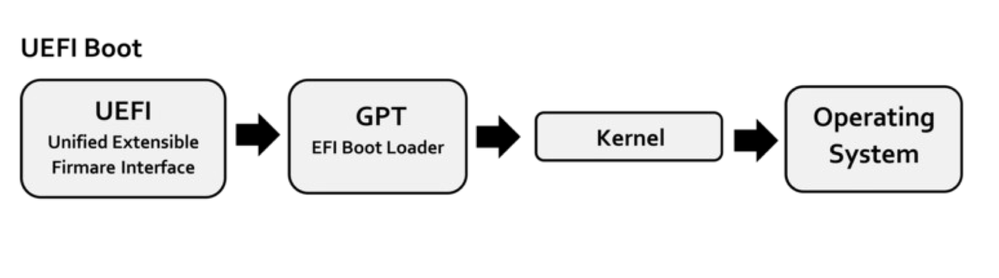

## UEFI Boot Process

[Wikimedia](https://upload.wikimedia.org/wikipedia/commons/1/17/UEFI_boot_process.png)

1. The computer is turned on and the UEFI firmware on the motherboard starts initializing the hardware.
The UEFI firmware looks for attached drives that contain EFI system partitions (ESP). Depending on the boot order set in the UEFI firmware,
one of the ESPs is selected and the EFI application (typically a bootloader) is started.
UEFI looks for this application at \EFI\BOOT\BOOTX64.EFI (for x86 systems) on the ESP.
2. The EFI application uses the UEFI API (boot services) to interface with hardware and perform its job,
which is usually either loading a kernel directly (Windows bootloader or Linux kernel EFI stub) or displaying a menu to the user,
to allow an OS selection (grub).
3. The kernel then starts processes, loads drivers etc. The bootloader usually terminates the UEFI boot services so the OS takes control of the system.
Only the UEFI runtime services can be accessed after that which allow reading/setting of UEFI variables.

## BIOS Boot Process

In older non-UEFI machines the boot process works conceptually similar but it is more complicated because of backwards-compatibility.
For example, execution is passed to the bootloader in 16 bit mode which means the bootloader has to switch to 32 bit or 64 bit mode,
if it wants to use more than 1MiB (16 bit limit) or 4GiB (32 bit limit) of memory. It also has to switch back to 16 bit mode every time
it triggers a BIOS-interrupt to interface with hardware etc.
Also, the bootloader must sit in the first sector of a drive (boot sector) which is only 512 bytes long.
This means BIOS-bootloaders have multiple stages where the first (very small) stage is in the boot sector,
which loads the second stage, which possibly loads a third and final stage that can then load the OS kernel.
BIOS is increasingly deprecated in favor of UEFI, which is why this repository only focuses on UEFI.

## UEFI API

When the UEFI firmware starts an EFI application, it passes the [EFI System Table](https://uefi.org/specs/UEFI/2.9_A/04_EFI_System_Table.html)
and an Image Handle (like a reference to the loaded image itself) to the application.
The EFI System Table contains pointers to the Boot Services and the Runtime Services which are both a list
of function pointers. This is the UEFI API. Most of the functions a bootloader uses are in the Boot Services.
In [uefi-rs](https://github.com/rust-osdev/uefi-rs) these are abstracted into a globally accessible API under [`uefi::boot`](https://docs.rs/uefi/latest/uefi/boot/index.html).

The UEFI API tries to stay relatively abstract to make additions for new hardware or protocols easy. The core concepts of the UEFI API are:

1. **Handles**: These are opaque pointers which represent some kind of resource. This can be a disk, a partition on a disk, a driver, an EFI application, a network device, etc.
2. **Protocols**: Handles support various protocols. For example, a handle might support the PartitionInfo, DiskIO and BlockIO protocols. Protocols can be opened for handles and provide some kind of API. For example, the [DiskIO](https://docs.rs/uefi/latest/uefi/proto/media/disk/struct.DiskIo.html) protocol provides the functions read_disk and write_disk.

The Boot Services can be used to find handles that support a certain protocol or get the protocols a handle supports.
The work is then done using the APIs these protocols provide.

## Device Paths

[Device Paths](https://uefi.org/specs/UEFI/2.10/10_Protocols_Device_Path_Protocol.html?highlight=device%20paths) are another concept in UEFI. While handles provide an opaque interface to a device, device paths provide information about the physical location of a device.
For example, a device path for a hard drive attached over USB might look like this:

    PciRoot(0x0)/Pci(0x4,0x0)/USB(0x1,0x0)/HD(1,MBR,0xBE1AFDFA,0x3F,0xFBFC1)

A device path for a file might look like this:

    PciRoot(0x0)/Pci(0x1,0x1)/Ata(Primary,Master,0x0)/HD(1,MBR,0xBE1AFDFA,0x3F,0xFBFC1)/\efi\boot\bootx64.efi

Device Paths consist of [Device Path Nodes](https://docs.rs/uefi/latest/uefi/proto/device_path/struct.DevicePathNode.html) which can be iterated and provide information like the PCI device a hard drive is attached to.
We use device paths in this bootloader only for two things:
1. When chainloading another EFI application the API requires that we pass the device path 
of the EFI image file we load.
2. For determining the linux-like names of disks.
Linux names drives depending on their type (For example /dev/sdX for hard drives and /dev/nvmeXnYpZ for nvme devices)
and the order in which it "finds them". I could not find documentation on how this order is defined
but from my testing it orders them by PCI device index (and other factors if multiple drives are attached at the same PCI interface).
We can get this information from device paths and then guess the names linux will assign these block devices.
We need this to set the "root" parameter of the linux command line if we don't use UUIDs (which I did not implement yet).

## Linux Boot Process (x86)

The Linux x86 boot process is described in the kernel [docs](https://github.com/torvalds/linux/blob/v4.16/Documentation/x86/boot.txt).
The basic process follows these steps:
1. Loading the kernel image into memory.
2. Extracting the kernel header. This is a list of parameters exchanged between kernel and bootloader.
Some of these (e.g. kernel_version) are read-only for the bootloader and some of these (e.g. cmd_line_ptr)
must be set by the bootloader.
3. Setting parameters like cmd_line_ptr etc. in the kernel header. For the modern (not 16 bit) boot process there are
also additional parameters in the [zero page](https://github.com/torvalds/linux/blob/v4.16/Documentation/x86/zero-page.txt)
that have to be set like the memory map that tells the kernel about free and occupied memory regions.
4. Preparing the environment expected by the boot entry points. For 64 bit this means setting up [paging](https://wiki.osdev.org/Paging)
and a [GDT](https://wiki.osdev.org/Global_Descriptor_Table).
5. Jumping to the entry point.

The Linux x86 boot process defines multiple entry points:
1. ancient 16 bit
2. 32 bit
3. 64 bit
4. EFI (deprecated)

This bootloader supports the 64 bit and EFI entry points. The (unfortunately deprecated) EFI handover protocol
makes life easy for the bootloader because it takes care of step 4 and parts of step 3 (like finding correct video settings)
of the boot process.

## 64 bit entry point (in detail)

The Linux boot protocol has multiple versions (2.00 - 2.12). The newest version, 2.12, has existed for 12 years, so I decided to not support older versions because these have much more complex requirements for the bootloader. With version 2.12 there are lower requirements for the memory layout that needs to be set up before starting the kernel. In this version the process is the following:

1. Load the kernel image into memory (and the ramdisk if present).
2. Parse the kernel header at offset +0x1F1 and check if this boot protocol version is supported by the bootloader.
3. Allocate a page for the command line string and copy it there. Put the pointer to the page into the kernel header.
4. If ramdisk present: Copy the ramdisk to an aligned address. The alignment requirements are given in the kernel header. Set the ramdisk pointer and size in the kernel header.
5. Copy the protected-mode kernel code to an aligned address. The protected-mode kernel starts
right after the real-mode part of the kernel whose size can be calculated using the kernel header (setup_sects*512).
6. Copy the kernel header (offset +0x1F1 from the start of the kernel image) into the zero page at offset +0x1F1
7. Set the video parameters in the zero page. I found that newer kernels do this themselves so it does not matter what we put there but older kernels rely on the bootloader for this.
8. Create a GDT with flat 4 GiB code and data segments.
9. Build the page tables. "The range with setup_header.init_size from start address of loaded
kernel and zero page and command line buffer get ident mapping" ([boot protocol](https://github.com/torvalds/linux/blob/v4.16/Documentation/x86/boot.txt)). For simplicity I just identity-map all memory.
10. Exit the boot services. This returns the current memory map. Use this to set the memmory map in the zero page.
11. Set the GDTR.
12. Use inline assembly to set the prepared page table and set rsp to the prepared stack. Jump to the kernel entry point.

## Other operating systems

According to Wikipedia, Windows has supported UEFI even for Windows Vista (with Service Packs). Windows has its own bootloader that is an EFI application. This makes it easy to start, because EFI applications can easily be chainloaded with the UEFI API. I only tested this with Windows 10 but I expect other versions to work the same.

MacOS, [FreeBSD](https://wiki.freebsd.org/RootOnZFS/GPTZFSBoot) and [OpenBSD](http://undeadly.org/cgi?action=article&sid=20150902074526&mode=expanded&count=6) each have EFI bootloaders that could be chainloaded however I did not test any of them.

In the spirit of "rewrite in Rust" these could be reimplemented (and then merged into one unified bootloader) but there is very little documentation on their boot process so one would have to get into the source code and figure it out from there.

## Multiboot

[Multiboot](https://wiki.osdev.org/Multiboot) is a specification for a standardized handover process between bootloader and OS. This can be used to boot some exotic operating systems but I could not find many that support this. If you wanted to write your own OS though, then this would probably the way to make it bootable. I did not implement Multiboot in this bootloader.

## Boot Loader Specification

The [Boot Loader Specification](https://uapi-group.org/specifications/specs/boot_loader_specification/)
is a proposed standard for configuring the boot menu entries of a system.
In a nutshell, instead of the bootloader searching for bootable OS kernels,
the OS should create `/loader/entries/*.conf` files in the EFI system partition (ESP) for every bootable kernel.
The use of BLS is not very widespread so I did not implement it, although this should not be a difficult addition.
